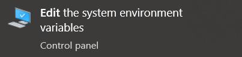
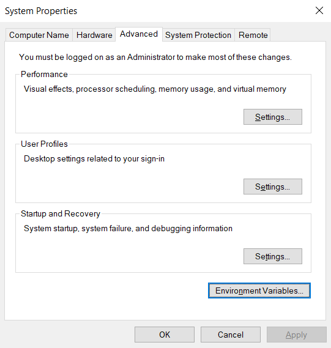
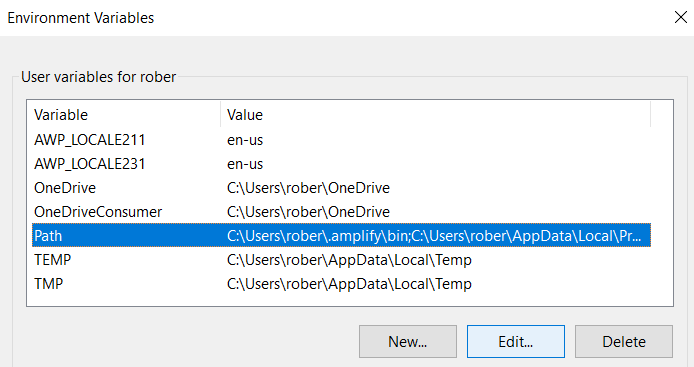
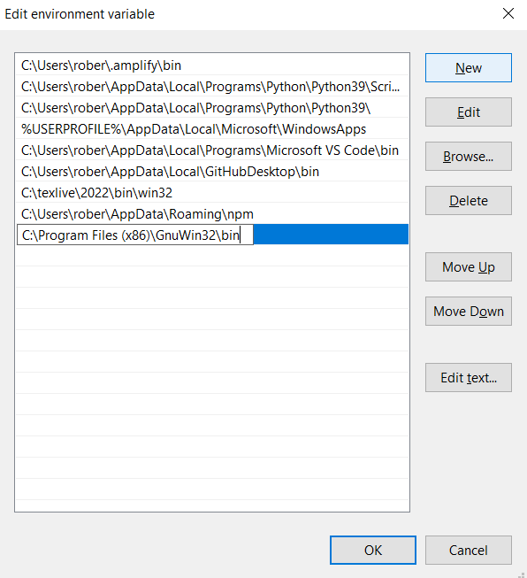

___
# Duck Typing ME 396P Project Repo

### Drive for presentation files
[Google Slides](https://docs.google.com/presentation/d/1IwQn3CiX4vNH62oOHMN-MBNEar08FHf94JwIBIe-q-0/edit#slide=id.p4)
___

### Dependencies (terminal):

You'll need a unix terminal to execute the necessary commands. MacOS and Linux have this by default, typically called "terminal". If you're using Windows, install [git bash](https://git-scm.com/downloads/win).

___

### Dependencies (make):

This project utilizes [make](https://www.gnu.org/software/make/) to simplify the setup and execution of our project. MacOS and Linux distros typically come with this preinstalled, but Windows does not. The following section details how to install make on each OS, in the event that it isn't installed.

To check whether you already have make installed, run the following command in a terminal:

```shell
make --version
```

If this runs without error, skip past this section. If you receive an error, install make using the steps below:

##### Windows
1. Click the following link, which downloads make from GnuWin32

    [make download](https://sourceforge.net/projects/gnuwin32/files/make/3.81/make-3.81.exe/download?use_mirror=psychz&download=)

2. Run the downloaded .exe, following the installation prompts. Make sure to leave the default install paths.

3. Go to Windows search and access "Edit the system environment variables".

    <center>
        
    </center>

4. Select "Environment Variables"

    <center>
        
    </center>

5. Edit Path

    <center>
        
    </center>

6. Add the following path

    <center>
        
    </center>

##### MacOS
1. Install homebrew by running the following command in terminal:
    
    ```shell
    /bin/bash -c "$(curl -fsSL https://raw.githubusercontent.com/Homebrew/install/HEAD/install.sh)"
    ```

2. Install make by running the following command in terminal:

    ```shell
    brew install make
    ```

##### Linux (Debian-based distros)
1. Run the following command in terminal

    ```shell
    sudo apt update && sudo apt install -y make
    ```

##### Linux (Arch)
1. Run the following command in terminal

    ```shell
    sudo pacman -Su make
    ```

Assuming you already have [Python](https://www.python.org/downloads/) installed, this covers all requirements for the project.

___

### Dependencies (cmake):

cmake is not standard on Unix systems, so we'll need to install it for MacOS, Linux, and Windows.

##### Windows

1. Open git bash and run the following command *(This assumes you're on Windows 10 or later)*:

    ```shell
    winget install cmake
    ```

##### MacOS
1. If you haven't already, install homebrew by running the following command in terminal:
    
    ```shell
    /bin/bash -c "$(curl -fsSL https://raw.githubusercontent.com/Homebrew/install/HEAD/install.sh)"
    ```

2. Install cmake by running the following command in terminal:

    ```shell
    brew install cmake
    ```

##### Linux (Debian-based distros)
1. Run the following command in terminal

    ```shell
    sudo apt update && sudo apt install cmake
    ```

##### Linux (Arch)
1. Run the following command in terminal

    ```shell
    sudo pacman -Su cmake
    ```
___

### Initializing the Project

1. **(OPTIONAL)** Create and activate a virtual environment in "./duck_typing" to contain the necessary Python libraries.
    
    - MacOS or Linux
    ```shell
    python3 -m venv .venv
    source .venv/bin/activate
    ```

    - Windows:
    ```shell
    python -m venv .venv
    source .venv/Scripts/activate
    ```

2. Open a terminal directed at "./duck_typing"

3. Run the following command:

    ```shell
    make init
    ```

    This installs the necessary Python libraries and remote files for project functionality.

___

### Running the Project

Running the project requires a single command:

```shell
make run
```

Read the following section for information on how to use the running application.

___

### Application Use

After executing ```make run``` for the first time, your webcam will turn on, and a calibration window will appear. In the calibration window: 

1. Turn your head to look at the green dot on-screen. Hold this position for two seconds.

2. Press the spacebar (the green dot will reappear in a new location)

3. Repeat steps 1 through 2 until the calibration window closes

<br>

Now, the primary window will open. After a brief animation, two turtles appear on-screen.

1. Turn your head to look at a specific turtle (the fill color should turn white)
    - This indicates which turtle you currently control

2. Use the arrow keys on your keyboard to control the turtle, moving your head with the turtle
    - Up $\rightarrow$ Forward
    - Down $\rightarrow$ Backward
    - Left $\rightarrow$ Turn Left
    - Right $\rightarrow$ Turn Right

3. At some point, switch your gaze to the opposite turtle, and use the same controls to move it as desired

<br>

Once you've finished having the time of your life controlling these turtles, close the program by pressing the ESCAPE key.

___
# Notes

Thank you for viewing our project. The following table lists member contributions:

<div align="center">

| Member | Section |
| :----: | :-----: |
| Robert Horvath | Gaze Detection |
| John Lyle | Agent Selection |
| Linus Kim | Control of Agents |
| Quinn Farquharson | Visualization and Interfaces |

</div>

Libraries used (per file):

<div align="center">

|                     | opencv |  dlib  | tkinter | turtle | itertools | screeninfo | numpy | threading | typing | dataclass |  json  |  OS   | filterpy |
| :-----------------: | :----: | :----: | :-----: | :----: | :-------: | :--------: | :---: | :-------: | :----: | :-------: | :----: | :---: | :------: |
| ./engine/agent_controller.py |||||||||||||
| ./engine/agent_selection.py |||||||||||||
| ./engine/agent_state.py |||||||||||||
| ./engine/gaze_detection.py |||||||||||||

</div>

File Structure:

```
./
├── _assets/
│   ├── calibration_files/      # Cached calibration files
│   ├── dlib_typing.py          # Custom typing for dlib library
│   └── shape_predictor.dat     # Pre-trained Predictor
├── engine/
│   ├── agent_controller.py     # Logic for controlling agents
│   ├── agent_selection.py      # Logic for selecting agents
│   ├── agent_state.py          # State variable for agents
│   └── gaze_detection.py       # Logic for deriving gaze from webcam
├── _ico/
│   ├── cb.png                  # Unchecked checkbox image
│   └── c.png                   # Checked checkbox image
├── .gitignore
├── main.py
├── makefile
├── README.md
└── requirements.txt            # Python library requirements
```
___
